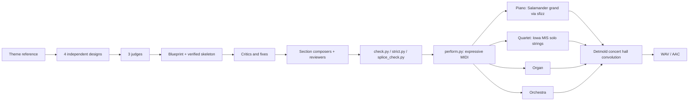

<div align="center">

# Jurassic Fugue

**Bach-style fugues on John Williams's Theme from Jurassic Park, written in LilyPond, proven by a counterpoint checker, and performed on sampled piano, string quartet, pipe organ and orchestra.**

[](https://github.com/longevityboris/jurassic-fugue/stargazers)
[](https://x.com/longevityboris)
[](LICENSE)
[](https://lilypond.org)
[](https://www.python.org)

</div>

---

The theme opens with a held B-flat, a dip to A, and back: a lower neighbour note. This repository treats that little gesture the way Bach treated the Royal Theme in the *Musical Offering*. It turns the tune into fugue subjects, sets them against countersubjects, inverts them, overlaps them in stretto, stretches them into long notes and combines them, and every contrapuntal claim is checked by a program before a note is kept.

There are two pieces.

| Piece | Form | Key | Length | Status |
|---|---|---|---|---|
| **Fugue on the Theme from Jurassic Park** | four-voice organ fugue | B-flat major | 37 bars, about 2¼ min | finished |
| **The Neighbour**, ricercar a 4 | double fugue with a Beethoven-style arc (Op. 110) | B-flat minor to B-flat major | about 62 bars, about 3¾ min | being composed |

<div align="center">

<br><sub>Page 1 of the finished organ fugue (<code>fugue.ly</code>)</sub>
</div>

## The Neighbour: one score, four performances

The ricercar is written once, as four independent voices, and then performed four ways:

| Version | Instruments | Model |
|---|---|---|
| Bach | pipe organ, manuals and pedal, dynamics by registration | the organ fugues |
| Beethoven | solo concert grand (a string-quartet reading as a bonus) | Op. 110 finale, Grosse Fuge |
| Symphonic | romantic orchestra, colours handed between instruments | Webern's orchestration of the Ricercar a 6 |
| Ensemble | piano and string quartet together | Shostakovich, Piano Quintet Op. 57, fugue |

Its plan, in brief: the tune opens alone at its own pitch; a chromatic lament answers it; the subject is overlapped with itself until the harmony collapses into diminished sevenths; a slow arioso sings the second half of the tune; the fugue returns upside down; both subjects sound together over a long pedal; and only at the end is the whole tune heard complete, in B-flat major, over its own mirror image. The full design, with every proof, is in [`ricercar/design/BLUEPRINT.md`](ricercar/design/BLUEPRINT.md).

## How it is made



- **Counterpoint checker** (`ricercar/tools/check.py`): parallel and hidden fifths and octaves, fifths on successive beats, voice crossing, ranges, bar lengths, and every dissonance with its justification (passing note, suspension, neighbour). Nothing is kept until it reports zero faults.
- **Stricter lab tools** (`ricercar/design/final-lab/`): `strict.py` for clashes, `splice_check.py` to prove that independently composed sections join cleanly and that locked subjects were not touched, `suspensions.py` to count real prepared suspensions.
- **Performance engine** (`ricercar/tools/perform.py`): turns the score into multi-track MIDI with a tempo map, dynamics and hairpins, subject entries brought forward, phrase breaths and fermatas.
- **Renderers** (`ricercar/audio/`): each one has its own README with measured evidence that soft and loud playing change the tone, not just the volume.

## Quick start

1. Install [LilyPond](https://lilypond.org) 2.24 or later and Python 3.12 with `numpy scipy mido soundfile music21`.
2. Engrave and check the organ fugue:
   ```bash
   lilypond fugue.ly
   python3 check.py
   ```
3. Fetch the samples and build the piano and quartet (large downloads, kept outside the repo):
   ```bash
   ricercar/audio/piano/setup_piano.sh
   ricercar/audio/strings/setup_strings.sh
   ```
4. Perform and render the ricercar skeleton on the piano:
   ```bash
   python3 ricercar/tools/perform.py ricercar/design/final-lab/SK_final.ly ricercar/design/final-lab/plan.json /tmp/sk.mid --target piano
   python3 ricercar/audio/piano/render_piano.py /tmp/sk.mid -o /tmp/sk_piano
   ```

## Repository layout

```
fugue.ly, NOTES.md, check.py     the finished organ fugue, its analysis, its checker
preview/                         score page images
ricercar/
  design/THEME.md                the reference melody
  design/proposal-1..4/          four independent designs and their proof labs
  design/BLUEPRINT.md            the chosen design, section by section
  design/final-lab/              verified skeleton, materials, proof labs, lab tools
  score/                         composed sections and the piano / quartet scores
  tools/                         checker, harmony x-ray, assembler, performance engine
  audio/piano|strings|organ|orchestra/   renderers, setup scripts, QA harnesses
  orchestration/                 who plays which voice when, for the ensemble versions
```

## Credits and licences

- The **Theme from Jurassic Park** is by John Williams (1993) and remains under copyright. This repository is a non-commercial study of fugal technique on that theme.
- Code and original text in this repository: [MIT](LICENSE).
- **Salamander Grand Piano V3** by Alexander Holm, CC BY 3.0. **University of Iowa Musical Instrument Samples** (solo strings, winds, brass). **Virtual Playing Orchestra 3** and **VSCO 2 Community Edition**. **Detmold concert hall impulse responses**, CC BY 4.0 ([Zenodo](https://zenodo.org/records/4116247)). Samples are downloaded by the setup scripts and are not stored here; each renderer's README lists exact sources and terms.

---

<div align="center">

If this made you hear a dinosaur theme as a ricercar, [star the repo](https://github.com/longevityboris/jurassic-fugue/stargazers) and [follow @longevityboris](https://x.com/longevityboris).

Built by [Boris Djordjevic](https://github.com/longevityboris) at [Paperfoot AI](https://paperfoot.com)

</div>
