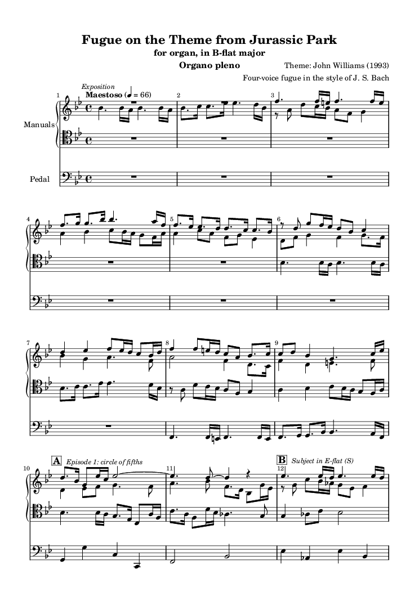
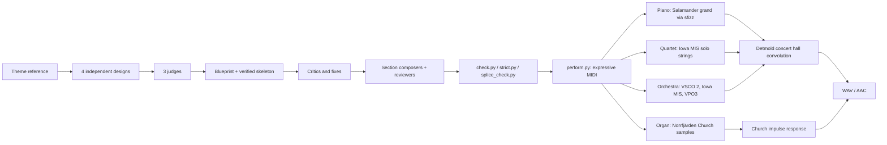

<div align="center">

# Jurassic Fugue

**Bach-style fugues on John Williams's Theme from Jurassic Park, written in LilyPond, proven by a counterpoint checker, and performed on sampled piano, string quartet, pipe organ and orchestra.**

[](https://github.com/longevityboris/jurassic-fugue/stargazers)
[](https://x.com/longevityboris)
[](LICENSE)
[](https://lilypond.org)
[](https://www.python.org)

</div>

---

The theme opens with a held B-flat, a dip to A, and back: a lower neighbour note. This repository treats that little gesture the way Bach treated the Royal Theme in the *Musical Offering*. It turns the tune into fugue subjects, sets them against countersubjects, inverts them, overlaps them in stretto, stretches them into long notes and combines them, and every contrapuntal claim is checked by a program before a note is kept.

There are two pieces.

| Piece | Form | Key | Length | Status |
|---|---|---|---|---|
| **Fugue on the Theme from Jurassic Park** | four-voice organ fugue | B-flat major | 37 bars, about 2¼ min | finished |
| **The Neighbour**, ricercar a 4 | fugue, inverted fugue and the tune's two halves combined, in a Beethoven-style arc (Op. 110) | B-flat minor to B-flat major | 66 bars, about 4 min | finished |

<div align="center">

<br><sub>Page 1 of the finished organ fugue (<code>fugue.ly</code>)</sub>
</div>

## The Neighbour: one score, four performances

The ricercar is written once, as four independent voices, and then performed four ways:

| Version | Instruments | Model | Render script | Length |
|---|---|---|---|---|
| Bach | pipe organ, manuals and pedal, dynamics by registration | the organ fugues | [`performance/bach_organ/render.sh`](ricercar/performance/bach_organ/render.sh) | 4:02 |
| Beethoven | solo concert grand | Op. 110 finale | [`performance/beethoven_piano/render.sh`](ricercar/performance/beethoven_piano/render.sh) | 4:04 |
| Beethoven (bonus) | string quartet, same reading as the piano | Grosse Fuge, Op. 131 | [`performance/beethoven_quartet/render.sh`](ricercar/performance/beethoven_quartet/render.sh) | 4:05 |
| Symphonic | romantic orchestra, colours handed between instruments | Webern's orchestration of the Ricercar a 6 | [`performance/symphonic/render.sh`](ricercar/performance/symphonic/render.sh) | 3:54 |
| Ensemble | piano and string quartet together | Shostakovich, Piano Quintet Op. 57, fugue | [`performance/quintet/make_spec.py`](ricercar/performance/quintet/make_spec.py), then `orchestrate.py` and `mix.py` | 3:54 |

Lengths include the lead-in and the hall's (or church's) decay. The audio is not in the repository: each script renders its version locally from the score, into `ricercar/performance/<version>/` (WAV and AAC), once the sample libraries are installed (see Quick start).

Its plan, in brief: the tune opens alone at its own pitch; a chromatic lament joins the answer; the subject is overlapped with itself until the harmony collapses into diminished sevenths; a slow arioso sings the second half of the tune; the fugue returns upside down; both halves of the tune sound together over a long pedal; and only at the end is the whole tune heard complete, in B-flat major, over the fugue's own countersubjects turned major.

- **Listener's guide**: [`ricercar/NOTES.md`](ricercar/NOTES.md), the idea, a form table with timings, what to listen for in each version, every learned device by bar number, and the tune tweaks.
- **Printed scores**: [`ricercar/score/out/piano.pdf`](ricercar/score/out/piano.pdf) and [`ricercar/score/out/quartet.pdf`](ricercar/score/out/quartet.pdf). PDFs are not committed; engrave them with `lilypond -o ricercar/score/out ricercar/score/piano.ly ricercar/score/quartet.ly`.
- **Design**: [`ricercar/design/BLUEPRINT.md`](ricercar/design/BLUEPRINT.md), the full design with every proof.

## How it is made



- **Counterpoint checker** (`ricercar/tools/check.py`): parallel and hidden fifths and octaves, fifths on successive beats, voice crossing, ranges, bar lengths, and every dissonance with its justification (passing note, suspension, neighbour). Nothing is kept until it reports zero faults.
- **Stricter lab tools** (`ricercar/design/final-lab/`): `strict.py` for clashes, `splice_check.py` to prove that independently composed sections join cleanly and that locked subjects were not touched, `suspensions.py` to count real prepared suspensions.
- **Performance engine** (`ricercar/tools/perform.py`): turns the score into multi-track MIDI with a tempo map, dynamics and hairpins, subject entries brought forward, phrase breaths and fermatas.
- **Renderers** (`ricercar/audio/`): each one has its own README with measured evidence that soft and loud playing change the tone, not just the volume.

## Quick start

1. Install [LilyPond](https://lilypond.org) 2.24 or later and Python 3.12 with `numpy scipy mido soundfile music21`.
2. Engrave and check the organ fugue:
   ```bash
   lilypond fugue.ly
   python3 check.py
   ```
3. Engrave and check the ricercar:
   ```bash
   lilypond -o ricercar/score/out ricercar/score/piano.ly ricercar/score/quartet.ly
   sh ricercar/design/final-lab/ck.sh ricercar/score/music-voices.ly
   ```
4. Fetch the samples and build the instruments (large downloads, kept outside the repo):
   ```bash
   ricercar/audio/piano/setup_piano.sh
   ricercar/audio/strings/setup_strings.sh
   ricercar/audio/organ/setup_organ.sh
   ricercar/audio/orchestra/setup_orchestra.sh
   ```
5. Render the versions (nothing is played through the speakers; each writes a WAV and an m4a next to its script):
   ```bash
   sh ricercar/performance/beethoven_piano/render.sh
   sh ricercar/performance/beethoven_quartet/render.sh
   bash ricercar/performance/bach_organ/render.sh
   sh ricercar/performance/symphonic/render.sh
   cd ricercar && python3 performance/quintet/make_spec.py \
     && python3 tools/orchestrate.py score/music-voices.ly design/final-lab/plan.json \
          performance/quintet/ricercar_quintet.json performance/quintet/ricercar_quintet \
     && python3 tools/mix.py performance/quintet/ricercar_quintet/manifest.json
   ```

## Repository layout

```
fugue.ly, NOTES.md, check.py     the finished organ fugue, its analysis, its checker
preview/                         score page images
ricercar/
  NOTES.md                       listener's guide to the finished ricercar
  design/THEME.md                the reference melody
  design/proposal-1..4/          four independent designs and their proof labs
  design/BLUEPRINT.md            the chosen design, section by section
  design/final-lab/              verified skeleton, materials, proof labs, lab tools
  score/                         the assembled score, its seven sections, the piano / quartet scores
  score/out/                     engraved PDFs (built locally, not committed)
  tools/                         checker, harmony x-ray, assembler, performance and orchestration engines
  audio/piano|strings|organ|orchestra/   renderers, setup scripts, QA harnesses
  orchestration/                 ensemble calibration and QA tests
  performance/                   the five versions: plans, scorings, render scripts, QA reports
```

## Credits and licences

- The **Theme from Jurassic Park** is by John Williams (1993) and remains under copyright. This repository is a non-commercial study of fugal technique on that theme.
- Code and original text in this repository: [MIT](LICENSE).
- **Salamander Grand Piano V3** by Alexander Holm, CC BY 3.0. **University of Iowa Musical Instrument Samples** (solo strings, winds, brass). **Virtual Playing Orchestra 3** and **VSCO 2 Community Edition**. **Norrfjärden Church organ** sample set by Lars Palo, CC BY-SA 4.0 (the licence carries over to the organ recordings). **Detmold concert hall impulse responses**, CC BY 4.0 ([Zenodo](https://zenodo.org/records/4116247)); **OpenAIR** Lady Chapel, St Albans Cathedral impulse response (University of York), CC BY 4.0. Samples are downloaded by the setup scripts and are not stored here; each renderer's README lists exact sources and terms.

---

<div align="center">

If this made you hear a dinosaur theme as a ricercar, [star the repo](https://github.com/longevityboris/jurassic-fugue/stargazers) and [follow @longevityboris](https://x.com/longevityboris).

Built by [Boris Djordjevic](https://github.com/longevityboris) at [Paperfoot AI](https://paperfoot.com)

</div>
